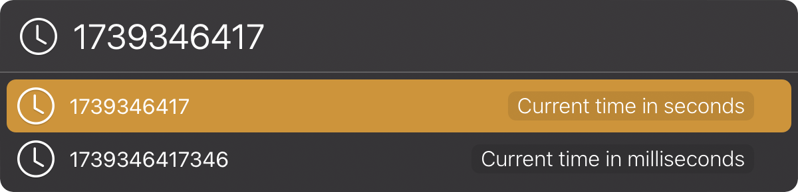

# LaunchBar Action: Convert epoch time

This is a quick and dirty [LaunchBar Action](https://obdev.at/products/launchbar/actions.html) to convert epoch times into human readable dates. When called with no input, it will return the current epoch time in seconds and miliseconds:

When given input with an epoch time, it will display that time in UTC and local time:

